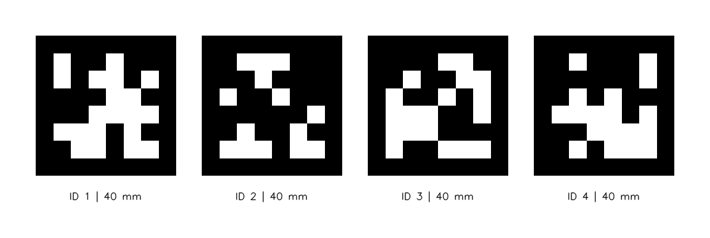
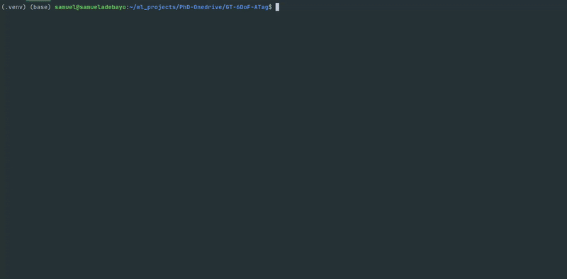
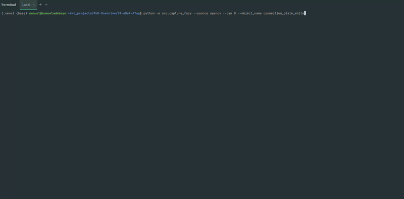
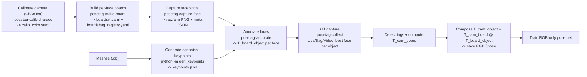

# PoseTag


PoseTag is scientific Python software for generating reproducible ground-truth
6-DoF object poses from RGB using AprilTags, camera calibration, per-face board
definitions, and Intel RealSense / webcam / video capture.
It is designed for training RGB-only pose networks in pick-and-place and
assembly-style scenarios.

The repository is being migrated from legacy names such as `GT-6DoF-ATag`,
`gt6dof_atag`, and `gtat*`. The canonical identity is now:

- Project/display name: `PoseTag`
- Repository name: `posetag`
- Python import namespace: `posetag`
- Primary CLI: `posetag`

Legacy names are still available as temporary compatibility aliases. New docs
and examples below prefer the canonical PoseTag naming.

## What this repo is for

A reproducible pipeline to convert AprilTags plus a few clicks into
high-quality 6-DoF ground truth for rigid objects, then capture multi-object
scenes with readable poses for training and validation of RGB-only pose
estimators.

## Contents

- **Calibration**: ChArUco colour camera calibration to `calib_color.yaml`
  with `fx`, `fy`, `cx`, `cy`, distortion, image size, and RMS.
- **Board building**: per-face AprilTag layout from a single frame to
  `<object_face>.yaml` plus a global `boards/tag_registry.yaml`.
- **Shot capture**: face shots with overlays and metadata to
  `shots/*_{raw,ann,meta}`.
- **Mesh keypoints**: canonical 3D keypoints per object in
  `objects/<object>/keypoints.json`.
- **Annotation**: click 4 face corners on a shot to compute `T_board_object`
  for that face.
- **Batch annotation**: drive the annotator across faces and shots
  automatically.
- **Ground-truth capture**: live / bag / video multi-object capture with
  per-frame review, best-face selection, and optional depth.
- **At runtime**: `T_cam_object = T_cam_board @ T_board_object`.

## Installation

Install in editable mode from a fresh clone:

```bash
python3 -m pip install -e .
```

Optional extras:

```bash
python3 -m pip install -e ".[apriltags]"
python3 -m pip install -e ".[realsense]"
python3 -m pip install -e ".[scipy]"
```

## Developer checks

Validate GitHub Actions workflows locally before commit or push:

```bash
./scripts/check-workflows.sh
```

The script uses a local `actionlint` binary when available, or falls back to
the `rhysd/actionlint` Docker image if Docker is installed.

Workflow changes are also linted automatically in GitHub Actions on pull
requests and pushes to `develop`.

## Project Management

Create or select an active PoseTag project:

```bash
posetag project new --name my_project
posetag project ls
posetag project current
posetag project home
```

By default PoseTag uses `~/posetag` as the projects home. During the migration
it still discovers legacy project homes under `~/gt-6dof` and still accepts the
legacy `GTAT_PROJECT` / `GTAT_PROJECTS_DIR` environment variables.

## Scientific Contract

The core pose composition must remain:

```text
T_cam_object = T_cam_board @ T_board_object
```

Current conventions used by the repository include:

- translations in meters
- board YAML files storing `tag_size_m` in meters
- quaternion outputs in `xyzw` order where emitted
- roll / pitch / yaw outputs reported in degrees where emitted

If any of those conventions change later, code, tests, docs, and output schema
notes should change together.

---

## Quick start

### 0) Generate AprilTags for printing

Create printable **AprilTag 36h11** sheets to stick on object faces.
The normal project workflow is:

```bash
posetag-gen-tags --project_root my_project --tag-size-mm 40 --ids 1-4 --dpi 150
```

This initializes or reuses `my_project/` and writes sheets to:

```text
my_project/boards/patterns/
```

Preview of generated sheet content:



Print at **100%** / **Actual size** so the black square edge matches
`--tag-size-mm`. Do not use “Fit to page”.

**Without a project root**

```bash
posetag-gen-tags --tag-size-mm 40 --ids 1-4 --out_dir apriltags_out
```

**Range of IDs**

```bash
posetag-gen-tags --project_root my_project --tag-size-mm 80 --ids 46-49
```

**Non-contiguous IDs**

```bash
posetag-gen-tags --project_root my_project --tag-size-mm 40 --ids 19,20,21,22,27,28,29,30
```

If the requested IDs do not fit on one sheet, PoseTag writes deterministic
page-numbered PNGs, for example `page01of03`, `page02of03`, and `page03of03`.
This tiny-paper command is mainly useful for testing pagination:

```bash
posetag-gen-tags --project_root my_project --tag-size-mm 40 --paper-mm 80x80 --ids 1-3 --dpi 100
```

Options you might tweak later: `--paper {A4,LETTER,LEGAL}`, `--paper-mm WxH`,
`--orientation`, `--dpi`, and `--out_dir`.

PNG output is guaranteed. If Pillow is installed, PoseTag also writes PDF
output; otherwise it reports that PDF output is optional and continues.

---

### 1) Calibrate the colour camera (ChArUco)


Press `SPACE` to capture a sample and `ENTER` to solve. Outputs a
`calib_color.yaml` containing `fx`, `fy`, `cx`, `cy`, distortion, image size,
and reprojection RMS. With `--project_root`, the latest calibration defaults to
`<root>/calib/calib_color.yaml`. Each run also stores raw calibration samples
under `<root>/calib/images/set_XX/` and a timestamped snapshot under
`<root>/calib/runs/<UTC-timestamp>/`.

**Generic webcam**

```bash
posetag-calib-charuco --project_root my_project --source opencv --cam 0 \
  --squares-x 3 --squares-y 5 --square-length-mm 50 --marker-length-mm 37 --dict 7X7_50
```

**Intel RealSense**

```bash
posetag-calib-charuco --project_root my_project --source realsense \
  --width 640 --height 480 --fps 30 \
  --squares-x 3 --squares-y 5 --square-length-mm 50 --marker-length-mm 37 --dict 7X7_50
```

**Video file**

```bash
posetag-calib-charuco --project_root my_project --source video --video sample.mp4 \
  --squares-x 3 --squares-y 5 --square-length-mm 50 --marker-length-mm 37 --dict 7X7_50
```

Keep print scale at `100%` / `Actual size`, and ensure `--squares-x`,
`--squares-y`, `--square-length-mm`, `--marker-length-mm`, and `--dict` match
the printed ChArUco board. OpenCV webcams treat `--width` / `--height` as
best-effort; the YAML records the actual stream size used during calibration.
Use the recorded `image_width` / `image_height` for downstream capture.

For the full Step 1 contract, failure modes, and verification checklist, see
[`docs/workflows/step1_calibrate_charuco.md`](docs/workflows/step1_calibrate_charuco.md).

Sample `calib_color.yaml`:

```yaml
camera_matrix:
  cx: 327.64591864758034
  cy: 191.92344695734758
  data:
  - - 1130.1711396910728
    - 0.0
    - 327.64591864758034
  - - 0.0
    - 1137.6243734485495
    - 191.92344695734758
  - - 0.0
    - 0.0
    - 1.0
  fx: 1130.1711396910728
  fy: 1137.6243734485495
distortion_coefficients:
  data:
  - - -0.4270123490995857
    - 6.863413191402844
    - -0.010742366737405607
    - -0.0025807724510832734
    - -63.07160252228832
  k1: -0.4270123490995857
  k2: 6.863413191402844
  k3: -63.07160252228832
  p1: -0.010742366737405607
  p2: -0.0025807724510832734
image_height: 480
image_width: 640
model: plumb_bob
notes: ChArUco 3x5, square=50.0mm, marker=37.0mm, dict=7X7_50
reproj_rms: 0.13782644794293097
```

---

### 2) Build per-face boards and tag registry



Capture one view with all tags on a face visible, pick an **origin** ID, and
write a face YAML plus update the project tag registry. The board frame is the
origin tag centre; board x/y axes follow the origin tag axes; planar boards
should have z offsets approximately equal to `0`.

**OpenCV webcam**

```bash
posetag-make-board --project_root my_project \
  --source opencv --cam 0 \
  --object_name connection_plate_white_sideA \
  --calib calib_color.yaml \
  --tag_size_mm 80
```

**Intel RealSense**

```bash
posetag-make-board --project_root my_project \
  --source realsense --width 640 --height 480 --fps 30 \
  --object_name connection_plate_white_sideA \
  --calib calib_color.yaml \
  --tag_size_mm 80
```

**From a video**

```bash
posetag-make-board --project_root my_project \
  --source video --video sample.mp4 \
  --object_name connection_plate_white_sideA \
  --calib calib_color.yaml \
  --tag_size_mm 80
```

`--tag_size_mm` is the physical black-square edge size of the AprilTags in
millimetres. The board YAML stores this as `tag_size_m` in metres.

With `--project_root my_project --calib calib_color.yaml`, PoseTag first looks
for the Step 1 calibration at:

```text
my_project/calib/calib_color.yaml
```

Absolute calibration paths are used exactly as supplied. Relative paths retain
legacy compatibility after the project calibration lookup.

Controls and prompts:

- `ENTER`: capture the current frame and estimate tag poses.
- `ESC`: exit cleanly without writing board YAML.
- After capture, enter the comma-separated tag IDs to include, then choose the
  origin ID from the selected IDs.

**Outputs**

- `my_project/boards/<object_name>.yaml`
  with `origin_id`, `tag_size_m`, and per-tag `cx`, `cy`, and `yaw_deg`.
- `my_project/boards/tag_registry.yaml`
  with tag-ID to face-YAML mappings.
- Optional `my_project/boards/shots/*` audit images when `--save_shot` is
  enabled.

Tips:

- add `--project_root <path>` to create or select a project explicitly
- otherwise the resolver uses your current or last project
- use `--out_dir`, `--registry`, and `--shots_dir` to override board, registry,
  and audit-shot paths
- use `--z_thresh` (default `0.01` m) to enforce planarity
- use `--allow_nonplanar` to proceed with a warning
- source and calibration failures are checked before board YAML or registry
  output artifacts are created

**Example board YAML** (`connection_plate_white_sideA.yaml`)

```yaml
object: connection_plate_white_sideA
family: tag36h11
tag_size_m: 0.08
origin_id: 52
tags:
- id: 52
  cx: 0.0
  cy: 0.0
  yaw_deg: 0.0
- id: 53
  cx: 0.1
  cy: -0.2
  yaw_deg: 180.0
notes: "Board frame = origin tag centre; x,y follow origin tag axes; z ≈ 0."
```

**Example tag registry** (`tag_registry.yaml`)

```yaml
version: 1
updated: "2025-11-09T18:50:42Z"
tags:
  "52":
    object: connection_plate_white_sideA
    yaml: my_project/boards/connection_plate_white_sideA.yaml
  "53":
    object: connection_plate_white_sideA
    yaml: my_project/boards/connection_plate_white_sideA.yaml
```

The registry is updated each time you run `posetag-make-board`. If the same tag
ID is already mapped to another board YAML, PoseTag warns and preserves the
existing mapping so conflicts are not silently overwritten.

Faces may use different tag sizes; each face YAML stores its own `tag_size_m`.

---

### 3) Capture face shots for annotation



Once per-face boards and the tag registry exist, the next step is to capture
wide shots of each face with detections overlaid. These images and metadata are
later used to solve the board-to-object transform.

**Quick start**

```bash
posetag-capture-face --object_name connection_plate_white
# Optional UI sizing
#   --panel_w 560
#   --recent_w 480
# Optional saving layout / manifest
#   --layout {flat,by_object,by_object_side,split_type}
#   --manifest shots/manifest.csv
```

**Other sources**

```bash
posetag-capture-face --source opencv --cam 0 --object_name connection_plate_white
posetag-capture-face --source video --video sample.mp4 --object_name connection_plate_white
```

**Notes**

- Outputs live under your active project:
  `<root>/shots/<object_base>/side<Side>/..._{raw,ann}.png` and `..._meta.json`
- `--manifest` appends rows to `<root>/shots/manifest.csv`
- `--calib` and `--registry` default to
  `<root>/calib/calib_color.yaml` and `<root>/boards/tag_registry.yaml`

**Workflow in the viewer**

- `o` picker with `↑/↓` or `W/S/K/J`, `Enter` to select
- `a` auto-side on or off
- `f` cycle faces when auto mode is off
- `ENTER` save, with double-press within 3 seconds to force a save if expected
  tags are missing
- `g` panels, `h` help, `q` or `ESC` quit

You can pass either a base object name such as
`connection_plate_white` or a full face such as
`connection_plate_white_sideA`.

**Optional layout and UI sizing**

```bash
posetag-capture-face --layout split_type --raw_dir shots/images --ann_dir shots/ann --meta_dir shots/meta
posetag-capture-face --panel_w 560 --recent_w 480
```

```text
shots/
  <object_base>/
    side<SideLetter>/
      <object_base>_side<SideLetter>_<YYYYMMDD_HHMMSS>_raw.png
      <object_base>_side<SideLetter>_<YYYYMMDD_HHMMSS>_ann.png
      <object_base>_side<SideLetter>_<YYYYMMDD_HHMMSS>_meta.json
```

`*_meta.json` includes camera intrinsics, detected and expected IDs, face YAML,
and save paths.

**Alternative layouts**

- `--layout flat` writes everything in `shots/`
- `--layout by_object` writes to `shots/<object_base>/...`
- `--layout split_type` writes separate raw, annotated, and metadata folders

**Manifest (optional)**

When `--manifest` is enabled, PoseTag appends one row per save to
`shots/manifest.csv`. The current manifest includes fields such as:

- `timestamp`
- `object_base`, `object_full`, `side`
- `face_yaml`
- `path_raw`, `path_ann`, `path_meta`
- `width`, `height`, `fx`, `fy`, `cx`, `cy`
- `detected_ids`, `expected_ids`
- `validation_ok`, `auto_face`

---

### 4) Derive canonical 3D keypoints from meshes (once per object)

PoseTag currently includes a detailed mesh-keypoint utility that remains
module-invoked during the migration. It computes the 8 AABB corners in the
object frame, writes per-face corner orderings, and can also write
`object_config.yaml`.

**Current utility**

```bash
python3 -m gen_keypoints
```

Expected layout:

```text
<project_root>/
  meshes/<object>.obj
  objects/<object>/keypoints.json
  objects/<object>/object_config.yaml
  faces/<object>/sideA|B|C|D/*.yaml
```

What it does:

- lists meshes under `meshes/*.obj`
- computes an axis-aligned bounding box in the object frame
- writes `keypoints.json` containing corner points plus face mappings
- optionally writes `object_config.yaml`
- provides in-window previews and an optional Open3D view

Key controls:

- `W/S` or arrow keys to navigate meshes
- `ENTER` or `G` to generate `keypoints.json`
- `V` to toggle preview style
- `Z` for Open3D preview
- `O` to toggle writing `object_config.yaml`
- `A` to toggle auto side mapping

Typical outputs:

- `objects/<object_name>/keypoints.json`
- `objects/<object_name>/object_config.yaml`

Optional mesh visualisation:

```bash
python3 -m view_keypoints --object_name connection_plate_white --show_axes
```

---

### 5) Annotate each face shot to recover `T_board_object`

Click 4 corners; the tool detects tags to get `T_cam_board`, solves
`T_cam_object`, and then derives `T_board_object = inv(T_cam_board) @ T_cam_object`.

**Single shot**

```bash
posetag-annotate --shot /abs/path/to/shot_raw.png
```

**Batch across faces using the latest shot per face**

```bash
posetag-annotate --batch latest
posetag-annotate --batch latest --object-filter connection_plate_white
posetag-annotate --batch latest --force
```

**Browse picker**

```bash
posetag-annotate --browse
```

**Dry run**

```bash
posetag-annotate --batch latest --dry-run
```

**Outputs**

- YAML: `faces/<object>/sideA|B|C|D/<face_key>_T_board_object.yaml`
- Review images next to the raw shot:
  `*_ann.png` and `*_reproj.png`
- Auto-maintained face manifest:
  `faces/face_manifest.csv`

Batch annotation uses `shots/manifest.csv` as its source of truth for captures
and automatically rebuilds `faces/face_manifest.csv` from the YAML outputs.

Useful notes:

- `--check-tag-scale` reports inter-tag scale ratio `s`
- `--auto-correct-scale` divides `T_cam_board` translation by `s` when
  `|s-1| > --scale-tol`
- RMS reprojection error is shown during review and written into the YAML

---

### 6) Collect a ground-truth dataset (multi-object / multi-face)

Live RealSense, RealSense `.bag`, or any OpenCV-readable video. For each frame:

- detect tags once, even when faces use mixed tag sizes
- choose the best visible face per object
- compose `T_cam_object = T_cam_board @ T_board_object`
- review annotated, reprojection, and status panels before saving

**Live (RGB, optional aligned depth)**

```bash
posetag-collect --mode live --session run01 --calib calib_color.yaml --rs_w 640 --rs_h 480 --rs_fps 30
# add --save_depth to save aligned depth .npy per accepted frame
```

**Playback from `.bag`**

```bash
posetag-collect --mode bag --bag path/to/rec.bag --session run02 --calib calib_color.yaml
```

**Any video**

```bash
posetag-collect --mode video --video sample.mp4 --session run03 --calib calib_color.yaml
```

**Keys**

- `ENTER` / `y` / `s`: accept and save current view
- `SPACE` / `p`: pause or resume
- `r` / `n` / `BACKSPACE`: reject or skip frame
- `h`: toggle help
- `ESC` / `q`: abort current frame
- `Q` / `X`: quit all

Important: the stream resolution must match `calib_color.yaml`
(`image_width` / `image_height`). Use `--rs_w` / `--rs_h` or recalibrate.

**Outputs (per accepted frame)**

```text
datasets/<session>/
  images/
    Run_<YYYYMMDD-HHMMSS>_rgb_frame_<000000>.png
  annotated/
    Run_<YYYYMMDD-HHMMSS>_annotated_frame_<000000>.png
  reproj/
    Run_<YYYYMMDD-HHMMSS>_reproj_frame_<000000>.png
  depth/
    Run_<YYYYMMDD-HHMMSS>_depth_frame_<000000>.npy
  annotations/
    Run_<YYYYMMDD-HHMMSS>_frame_<000000>.json
  session.yaml
  <session>.jsonl
```

`session.yaml` stores session-wide metadata for the run, and
`<session>.jsonl` is a rolling capture log listing frame names, timestamps, and
saved objects.

**Per-frame annotation schema (abridged)**

```json
{
  "version": "1.0",
  "metadata": {
    "dataset_name": "<session>",
    "frame_index": 0,
    "timestamp": 1724631234.123,
    "tag_family": "tag36h11"
  },
  "image_filename": "Run_<tag>_rgb_frame_<idx>.png",
  "annotated_image": "Run_<tag>_annotated_frame_<idx>.png",
  "reproj_image": "Run_<tag>_reproj_frame_<idx>.png",
  "depth": "Run_<tag>_depth_frame_<idx>.npy",
  "camera_intrinsics": {
    "fx": 594.97,
    "fy": 601.72,
    "cx": 307.15,
    "cy": 267.01,
    "width": 640,
    "height": 480
  },
  "camera_extrinsics": {
    "position": [tx, ty, tz],
    "orientation": [x, y, z, w],
    "rpy_deg": [roll, pitch, yaw]
  },
  "objects": [
    {
      "class_id": 2,
      "class_name": "connection_plate",
      "2D_center": [cx, cy],
      "width": 0.25,
      "height": 0.18,
      "6DOF_pose": {
        "position": [tx, ty, tz],
        "orientation": [roll, pitch, yaw],
        "rotation": [x, y, z, w],
        "dimensions": [dx, dy, dz]
      }
    }
  ]
}
```

Notes on interpretation:

- `position` fields are in meters
- `camera_extrinsics.orientation` is a quaternion in `[x, y, z, w]` order
- `objects[].6DOF_pose.orientation` is roll, pitch, yaw in degrees
- `objects[].6DOF_pose.rotation` is a quaternion in `[x, y, z, w]` order
- 2D centers and box sizes are normalized by image width and height
- the raw image saved in `images/` is tag-covered to suppress AprilTags visually

Common options include:

- `--continuous`
- `--max_frames N`
- `--save_depth`
- `--axes {both,board,object,none}`
- `--bbox-mode {auto,face,object}`
- `--check-tag-scale`
- `--auto-correct-scale`

Selection notes:

- per object, the dataset stage keeps the best visible face using tag count
  first and area-based score as a tiebreaker
- when the origin tag is visible, it is preferred for `T_cam_board`
- otherwise PoseTag uses the visible common tag with the highest
  `decision_margin`

---

## Ground-truth composition

At capture time:

1. Detect AprilTags in the RGB frame.
2. Pick a visible tag `i` on the face.
3. Use the tag solver to compute `T_cam_tag_i` from camera intrinsics and the
   face’s `tag_size_m`.
4. Use the board YAML to get `T_board_tag_i`.
5. Compute `T_cam_board = T_cam_tag_i @ inv(T_board_tag_i)`.
6. Use annotation output to load `T_board_object` for that face.
7. Compose the final pose:

   ```text
   T_cam_object = T_cam_board @ T_board_object
   ```

Pose outputs can then include translation in meters, roll/pitch/yaw in degrees,
and quaternions in `xyzw` order depending on the stage.

---

## Block diagram



---

## File layout

```text
<project_root>/
  boards/
    patterns/
    shots/
    tag_registry.yaml
    <object_face>.yaml
  calib/
    calib_color.yaml
  faces/
    <object>/sideA|B|C|D/<face_key>_T_board_object.yaml
    face_manifest.csv
  meshes/
    *.obj
  objects/
    <object_name>/
      keypoints.json
      object_config.yaml
  shots/
    <object_base>/side<SideLetter>/*_{raw,ann,meta}.png|json
    manifest.csv
  datasets/
    <session>/
      images/
      annotated/
      reproj/
      depth/
      annotations/
      session.yaml
      <session>.jsonl
  logs/
```

## Repository entry points

During Phase 0, the public CLI is PoseTag-first, but some utilities are still
module-invoked while packaging catches up. The current practical entry points
are:

- `posetag-gen-tags` -> AprilTag sheet generation
- `posetag-calib-charuco` -> ChArUco colour calibration
- `posetag-make-board` -> per-face board YAML and tag registry creation
- `posetag-capture-face` -> face-shot capture
- `posetag-annotate` -> single, batch, and browse annotation flows
- `posetag-collect` -> dataset capture
- `python3 -m gen_keypoints` -> canonical keypoint generation
- `python3 -m view_keypoints` -> mesh/keypoint visualisation

---

## Notes and tips

- **Resolution must match calibration**:
  if `calib_color.yaml` is 640×480, start live capture at 640×480.
- **Best face selection**:
  the capture pipeline prefers faces with more visible tags and then uses other
  ranking signals such as projected geometry.
- **Depth saving**:
  `--save_depth` writes aligned depth `.npy` arrays per accepted frame.
- **Pose fields**:
  translation is in meters; roll/pitch/yaw are in degrees; quaternions are
  emitted in documented order for that stage.
- **RealSense stability**:
  the repo limits thread counts and warms up capture in several paths to reduce
  driver hiccups.

## Migration

See [MIGRATION.md](MIGRATION.md) for the old-to-new naming map and the
compatibility aliases intentionally retained during Phase 0.
