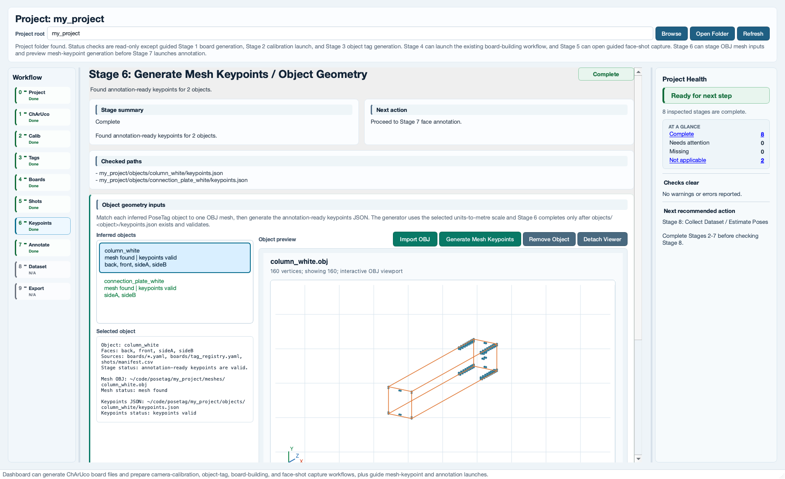

# Step 4: Mesh Keypoints / Object Geometry

This workflow validates the PoseTag Step 4 command:

```bash
posetag-gen-keypoints --project_root <path> --mesh meshes/<object>.obj
```

Step 4 links a known PoseTag object identity to a 3D mesh and writes the
annotation-ready object geometry file:

```text
objects/<object>/keypoints.json
```

The output is used by the later annotation workflow to connect clicked face
corners in face-shot images to canonical 3D object-frame points. Step 4 does
not compute `T_board_object`, batch annotations, dataset outputs, or runtime
poses.

## Scientific Assumptions

- The mesh represents one rigid PoseTag object, not one captured image.
- The canonical object frame is the mesh frame after applying any configured
  `T_mesh_object` transform.
- The current annotation-ready generator supports `.obj` meshes through the
  lightweight OBJ vertex loader.
- `units_to_m` converts mesh units into metres for saved keypoint coordinates.
- `objects/<object>/object_config.yaml` records mesh metadata and the
  `T_mesh_object` matrix. The default matrix is identity, meaning mesh frame
  and object frame are the same.
- `T_mesh_object` maps object-frame points into mesh-frame coordinates for
  visualization. The generator applies the configured matrix to mesh vertices
  before constructing the axis-aligned bounding box.
- Face names follow the existing `<object>_sideA`, `<object>_sideB`, ...
  convention used by board YAMLs, tag registry entries, face-shot metadata, and
  annotation.
- This stage does not change the runtime pose composition:
  `T_cam_object = T_cam_board @ T_board_object`.

## Required Inputs From Earlier Steps

PoseTag can infer known object identities and faces from:

- `boards/*.yaml`
- `boards/tag_registry.yaml`
- `shots/manifest.csv`

It preserves the existing `sideA`, `sideB`, ... convention and also recognizes
common physical face suffixes such as `front`, `back`, `left`, `right`, `top`,
and `bottom` when grouping object-face board names.

For example:

```text
boards/connection_plate_white_sideA.yaml
boards/connection_plate_white_sideB.yaml
boards/tag_registry.yaml
shots/manifest.csv
```

infer:

```text
Object: connection_plate_white
Faces: sideA, sideB
Output: objects/connection_plate_white/keypoints.json
```

Likewise, board names such as `column_white_front` and `column_white_back`
infer one object, `column_white`, with faces `front` and `back`.

If the mesh filename matches the object identity, PoseTag can infer the object:

```bash
posetag-gen-keypoints --project_root my_project \
  --mesh meshes/connection_plate_white.obj
```

If the mesh filename differs from the PoseTag object identity, map it
explicitly:

```bash
posetag-gen-keypoints --project_root my_project \
  --mesh meshes/unity_export_plate_v12.obj \
  --object_name connection_plate_white
```

Without `--object_name`, a mismatched mesh filename fails clearly when known
objects already exist.

## Command Examples

List inferred objects, faces, supported meshes, and expected outputs:

```bash
posetag-gen-keypoints --project_root my_project --list
```

Generate annotation-ready keypoints:

```bash
posetag-gen-keypoints --project_root my_project \
  --mesh meshes/connection_plate_white.obj \
  --units_to_m 1.0
```

Generate from millimetre CAD-style OBJ units:

```bash
posetag-gen-keypoints --project_root my_project \
  --mesh meshes/connection_plate_white.obj \
  --units_to_m 0.001
```

Overwrite an existing annotation-ready output:

```bash
posetag-gen-keypoints --project_root my_project \
  --mesh meshes/connection_plate_white.obj \
  --force
```

Keep an existing `keypoints.json` and write a versioned review copy such as
`keypoints_v2.json`:

```bash
posetag-gen-keypoints --project_root my_project \
  --mesh meshes/connection_plate_white.obj \
  --keep-both
```

The legacy interactive browser remains available:

```bash
python3 -m gen_keypoints
```

or:

```bash
posetag-gen-keypoints --project_root my_project --browse
```

## Dashboard Status

`posetag-gui` shows mesh keypoints as Stage 6, between face-shot capture and
annotation. It checks inferred objects from earlier workflow outputs, shows
the expected `meshes/<object>.obj` mesh input and
`objects/<object>/keypoints.json` annotation output for each object, and can
copy or import a selected `.obj` into the project `meshes/` folder. Importing
an OBJ generates `objects/<object>/keypoints.json` for that object when the
canonical keypoint file is absent, using the selected units-to-metre scale.
The dashboard can also remove the selected object's Stage 6 geometry artifacts
without deleting board definitions, face shots, or tag registry entries.
Clicking an inferred object displays an
interactive OBJ viewport for the staged mesh, or the expected import path when
the mesh is still missing. The viewport is a pre-generation inspection aid:
left-drag rotates, secondary-drag pans, and the mouse wheel zooms. Stage 6
still reports missing until the annotation-ready `objects/<object>/keypoints.json`
file exists and validates.



The Stage 6 command card still previews `posetag-gen-keypoints` for
reproducibility. The dashboard import and generation actions write only absent
canonical `keypoints.json` files; they do not overwrite existing or invalid
keypoints. Use `posetag-gen-keypoints --force` deliberately after confirming
units when a generated file needs replacement.

## Project Directory Side Effects

Default inputs and outputs:

```text
my_project/
  meshes/
    <object>.obj
  objects/
    <object>/
      keypoints.json
      object_config.yaml
  boards/
    <object>_sideA.yaml
    <object>_sideB.yaml
    tag_registry.yaml
  shots/
    manifest.csv
```

The legacy browser writes `logs/gen_keypoints.log`; the direct
`--mesh` command prints the generated output paths to the terminal.

`objects/<object>/keypoints.json` is the file expected by annotation and
dataset collection. Versioned files such as `keypoints_v2.json` are audit or
review copies and are not used automatically by annotation.

`canonical_keypoints/` is a separate legacy/experimental output from
`python3 -m generate_canonical_keypoints`. Those files contain sampled point
lists such as `<mesh_stem>_keypoints.json`; they do not contain the
annotation-ready `points` mapping plus `faces` mapping. They are not a
substitute for `objects/<object>/keypoints.json`.

## Keypoint JSON Schema

`objects/<object>/keypoints.json` currently contains:

```json
{
  "units_to_m": 1.0,
  "points": {
    "xmin_ymin_zmin": [0.0, 0.0, 0.0],
    "xmin_ymin_zmax": [0.0, 0.0, 0.02],
    "xmin_ymax_zmin": [0.0, 0.04, 0.0],
    "xmin_ymax_zmax": [0.0, 0.04, 0.02],
    "xmax_ymin_zmin": [0.1, 0.0, 0.0],
    "xmax_ymin_zmax": [0.1, 0.0, 0.02],
    "xmax_ymax_zmin": [0.1, 0.04, 0.0],
    "xmax_ymax_zmax": [0.1, 0.04, 0.02]
  },
  "faces": {
    "connection_plate_white_sideA": [
      "xmax_ymax_zmin",
      "xmax_ymax_zmax",
      "xmax_ymin_zmax",
      "xmax_ymin_zmin"
    ],
    "connection_plate_white_sideB": [
      "xmin_ymax_zmin",
      "xmin_ymax_zmax",
      "xmin_ymin_zmax",
      "xmin_ymin_zmin"
    ]
  }
}
```

The generator writes all eight AABB corners and four canonical side mappings
(`sideA` through `sideD`). If earlier workflow outputs infer additional face
labels such as `front` or `back`, the generator also writes matching
`<object>_<face>` entries so every inferred or captured face key is present for
annotation. Each face mapping lists exactly four point names in the click-order
convention expected by the annotation UI.

Coordinates are stored in metres after multiplying raw mesh coordinates by
`units_to_m`. `units_to_m`, mesh vertices, transformed bounds, and all saved
keypoint coordinates must be finite numeric values; `NaN` and `Infinity` are
invalid.

## Object Config Schema

When enabled, Step 4 also writes:

```text
objects/<object>/object_config.yaml
```

with:

```yaml
mesh:
  path: meshes/connection_plate_white.obj
  units_to_m: 1.0
  T_mesh_object:
    matrix:
      - [1.0, 0.0, 0.0, 0.0]
      - [0.0, 1.0, 0.0, 0.0]
      - [0.0, 0.0, 1.0, 0.0]
      - [0.0, 0.0, 0.0, 1.0]
notes: "Sides auto-mapped: A,B,C,D = +X, -X, +Y, -Y"
```

The default `T_mesh_object` is identity. If future work supports non-identity
mesh-to-object alignment, that change must preserve and test the documented
direction: object-frame points transformed by `T_mesh_object` land in the mesh
frame for visualization.

## Common Failure Modes

- Missing mesh files fail before output directories are created.
- Unsupported mesh suffixes fail clearly. The annotation-ready generator
  currently accepts `.obj`.
- A mesh filename that differs from known PoseTag object identities fails until
  `--object_name` is supplied.
- Existing `objects/<object>/keypoints.json` is not overwritten unless
  `--force` is supplied.
- `--force` and `--keep-both` cannot be combined.
- Non-finite or non-positive `--units_to_m` values fail before writing outputs.
- OBJ files with no vertex records, `NaN`, or `Infinity` vertex coordinates
  fail clearly.
- Existing keypoint JSON that omits any inferred/captured face key keeps Stage
  6 in a needs-attention state.

## Verify Before Step 5

Before moving to face annotation:

1. Confirm every object that will be annotated has
   `objects/<object>/keypoints.json`.
2. Confirm the object name matches the base object name used in board YAMLs,
   `boards/tag_registry.yaml`, and `shots/manifest.csv`.
3. Confirm `units_to_m` matches the mesh export units.
4. Confirm `faces` contains the expected `<object>_<face>` keys for every
   board/registry/manifest face that will be annotated.
5. Optionally run:

   ```bash
   python3 -m view_keypoints --project_root my_project \
     --object_name connection_plate_white --show_axes
   ```

   This visualization requires Open3D and is a manual inspection aid only.
