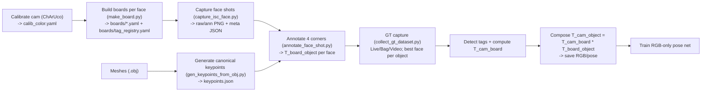

# GT-6DoF-ATag
     


Utilities and scripts to generate ground-truth 6-DoF object poses from RGB using AprilTags and Intel RealSense (D435i).
Designed for training RGB-only pose networks (e.g., ConPose) in pick-and-place / assembly scenarios.
## What this repo is for
A reproducible pipeline to convert AprilTags + a few clicks into high-quality 6-DoF ground truth for rigid objects, then capture multi-object scenes with readable poses for training/validation of RGB-only pose estimators.

## Contents

* **Calibration**: ChArUco colour camera calibration → `calib_color.yaml` (fx, fy, cx, cy, dist).
* **Board building**: Per-face AprilTag layout from a single frame → `<object_face>.yaml` and global `boards/tag_registry.yaml`.
* **Shot capture**: “Face shots” with overlays + meta → `boards/shots/*_{raw,ann,meta}`.
* **Mesh keypoints**: Canonical 3D keypoints per object → `objects/<object>/keypoints.json`.
* **Annotation**: Click 4 face corners on a shot to compute **T\_board\_object** for that face.
* **Batch annotation**: Drive the annotator across faces/shots automatically.
* **Ground truth capture**: Live/Bag/Video multi-object capture with per-frame review; best face per object; optional depth.
* **At runtime**: **T\_cam\_object = T\_cam\_board · T\_board\_object**.

---

## Quick start (scripts)
### 0) Generate AprilTags for printing

Create printable **AprilTag 36h11** sheets to stick on object faces.
Using `--project_root` also initializes the project and saves sheets to `<root>/boards/patterns/`.
Outputs: **PNG** (and **PDF** if Pillow is installed). Print at **100%**—the black square edge = `--tag-size-mm`.

**Range of IDs (inclusive)**

```bash
python -m src.gen_april_tags --project_root my_project --tag-size-mm 80 --ids 46-49
```

**Non-contiguous IDs**

```bash
python -m src.gen_april_tags --project_root my_project --tag-size-mm 40 --ids 19,20,21,22,27,28,29,30
```

<sub>Options you might tweak later: `--paper {A4,LETTER,LEGAL}` / `--paper-mm WxH`, `--orientation`, `--dpi`, `--out_dir`.</sub>

---

### 1) Calibrate the colour camera (ChArUco)

SPACE to capture a sample; ENTER to solve. Outputs a `calib_color.yaml` (fx, fy, cx, cy, k1..k3, image size, RMS).
With `--project_root`, output defaults to `<root>/calib/calib_color.yaml`.

**Generic webcam (default)**
```bash
python charuco_calibrate.py --source opencv --cam 0 \
  --squares-x 5 --squares-y 3 --square-length-mm 50 --marker-length-mm 37 --dict 7X7_100
````

**Intel RealSense**

```bash
python charuco_calibrate.py --source realsense --width 640 --height 480 --fps 30
```

**Video file**

```bash
python charuco_calibrate.py --source video --video sample.mp4
```

<sub>Keep print scale at 100%. OpenCV webcams treat --width/--height as best-effort; the YAML records the actual stream size.</sub>
Sample calibration file `calib_color.yaml`:

```yaml
camera_matrix:
  cx: 327.64591864758034
  cy: 191.92344695734758
  data:
  - - 1130.1711396910728
    - 0.0
    - 327.64591864758034
  - - 0.0
    - 1137.6243734485495
    - 191.92344695734758
  - - 0.0
    - 0.0
    - 1.0
  fx: 1130.1711396910728
  fy: 1137.6243734485495
distortion_coefficients:
  data:
  - - -0.4270123490995857
    - 6.863413191402844
    - -0.010742366737405607
    - -0.0025807724510832734
    - -63.07160252228832
  k1: -0.4270123490995857
  k2: 6.863413191402844
  k3: -63.07160252228832
  p1: -0.010742366737405607
  p2: -0.0025807724510832734
image_height: 480
image_width: 640
model: plumb_bob
notes: ChArUco 3x5, square=50.0mm, marker=37.0mm, dict=7X7_50
reproj_rms: 0.13782644794293097
```
---

### 2) Build per-face boards and tag registry


Capture one view with all tags visible, pick an **origin** ID, and write a face YAML plus update the tag registry under your active project. Outputs live under `<root>/boards/...` (not repo-relative `boards/...`).

**OpenCV webcam (default)**

```bash
python -m src.make_board \
  --object_name connection_plate_white_sideA \
  --calib calib_color.yaml \
  --tag_size_mm 80 \
  --save_shot
```

**Intel RealSense**

```bash
python -m src.make_board \
  --source realsense --width 640 --height 480 --fps 30 \
  --object_name connection_plate_white_sideA --calib calib_color.yaml --tag_size_mm 80
```

**From a video**

```bash
python -m src.make_board \
  --source video --video sample.mp4 \
  --object_name connection_plate_white_sideA --calib calib_color.yaml --tag_size_mm 80
```

**Outputs**

* `<root>/boards/<object_face>.yaml` (origin_id, tag_size_m, per-tag 2D offsets + yaw)
* `<root>/boards/tag_registry.yaml` (tag-ID → face YAML mapping; updated on each run)
* Optional `<root>/boards/shots/*` audit images (when `--save_shot`)

<sub>Tips: add `--project_root <path>` to create/select a project; otherwise the resolver uses your current/last project. Use `--z_thresh` (default `0.01` m) to enforce planarity or `--allow_nonplanar` to proceed with a warning.</sub>

**Example board YAML** (`connection_plate_white_sideA.yaml`)

```yaml
object: connection_plate_white_sideA
family: tag36h11
tag_size_m: 0.04
origin_id: 52
tags:
- id: 52
  cx: 0.0
  cy: 2.7755575615628914e-17
  yaw_deg: -6.095899809673727e-15
- id: 53
  cx: -0.0014025137524277254
  cy: -0.1884154905688507
  yaw_deg: 179.95955209337157
notes: "Board frame = origin tag centre; x,y follow origin tag axes; z ≈ 0."
```

**Example tag registry** (`tag_registry.yaml`)

```yaml
version: 1
updated: '2025-11-09T18:50:42Z'
tags:
  '52': {object: connection_plate_white_sideA, yaml: /home/samuel/gt-6dof/project-2025-11-08T23-10-29Z/boards/connection_plate_white_sideA.yaml}
  '53': {object: connection_plate_white_sideA, yaml: /home/samuel/gt-6dof/project-2025-11-08T23-10-29Z/boards/connection_plate_white_sideA.yaml}
  '54': {object: connection_plate_white_sideA, yaml: /home/samuel/gt-6dof/project-2025-11-08T23-10-29Z/boards/connection_plate_white_sideA.yaml}
  '55': {object: connection_plate_white_sideA, yaml: /home/samuel/gt-6dof/project-2025-11-08T23-10-29Z/boards/connection_plate_white_sideA.yaml}
```

The registry is updated each time you run `make_board`. If the same tag ID is already mapped to another face, you’ll be warned; resolve by editing or removing the older mapping if that’s intentional.

---

> Faces may use different tag sizes; each face YAML stores its own `tag_size_m`.

---


### 3) Capture “face shots” for annotation

Now that you’ve built per-face boards and recorded the tag registry (Step 2), the next step is to capture wide shots of each face with detections overlaid. These images + metadata will be used later to annotate and solve the board→object transform.

**Quick start (project-aware, RealSense by default)**
```bash
python -m src.capture_face --object_name connection_plate_white
# Optional UI sizing
#   --panel_w 560         # centre info panel width
#   --recent_w 480        # right "Last saved" panel width
# Optional saving layout / manifest
#   --layout {flat,by_object,by_object_side,split_type}   # default: by_object_side
#   --manifest boards/shots/manifest.csv                  # append one row per save
```
**Other sources**

```bash
# OpenCV webcam
python -m utils.capture_face --source opencv --cam 0 --object_name connection_plate_white

# From a video
python -m utils.capture_face --source video --video sample.mp4 --object_name connection_plate_white
```
**Notes**

* Outputs live under your active project (same resolver as Steps 1–2):

  * `<root>/shots/<object_base>/side<Side>/..._{raw,ann}.png` and `..._meta.json`
  * Appends to `<root>/shots/manifest.csv` if `--manifest` is used (defaults there if omitted).
* `--calib` and `--registry` default to `<root>/calib/calib_color.yaml` and `<root>/boards/tag_registry.yaml`.

**Workflow in the viewer**

* `o` picker (navigate ↑/↓/W/S/K/J, Enter select), `a` auto-side on/off, `f` cycle faces (when auto is off).
* `ENTER` save (double-press within 3s to force if expected tags are missing), `g` panels, `h` help, `q/ESC` quit.
* You can pass a base (`--object_name connection_plate_white`, side auto-deduced) or a full face (`..._sideA`).

**Optional layout & UI sizing**

```bash
# Layout: flat | by_object | by_object_side (default) | split_type
python -m utils.capture_face --layout split_type --raw_dir shots/images --ann_dir shots/ann --meta_dir shots/meta
# Panel widths
python -m utils.capture_face --panel_w 560 --recent_w 480
```
```
boards/shots/
  <object_base>/
    side<SideLetter>/
      <object_base>_side<SideLetter>_<YYYYMMDD_HHMMSS>_raw.png
      <object_base>_side<SideLetter>_<YYYYMMDD_HHMMSS>_ann.png
      <object_base>_side<SideLetter>_<YYYYMMDD_HHMMSS>_meta.json
```

* `*_meta.json` includes camera intrinsics, detected/expected IDs, face YAML, and save paths.

**Alternative layouts (optional)**

* `--layout flat` → everything in `boards/shots/`
* `--layout by_object` → `boards/shots/<object_base>/...`
* `--layout split_type` → separate folders; use `--raw_dir`, `--ann_dir`, `--meta_dir`

**Manifest (optional)**

* `--manifest boards/shots/manifest.csv` appends one row per save (paths, object/side, tags, OK flag, intrinsics).

---

### 4) Derive canonical 3D keypoints from meshes (once per object)

We write the 8 AABB corners in the **mesh frame** plus per-face corner ordering.

```bash
python -m src.gen_keypoints_from_obj \
  --obj meshes/connection_plate.obj \
  --object_name connection_plate_white \
  --units_to_m 1.0 \
  --auto_sides \
  --write_object_config
```

Outputs:

* `objects/<object_name>/keypoints.json`
* `objects/<object_name>/object_config.yaml`

---

### 5) Annotate each face shot → **T\_board\_object** (per face)

Click 4 corners; the tool detects tags to get **T\_cam\_board** and solves **T\_cam\_object**, then derives **T\_board\_object** for the face.

```bash
python -m src.annotate_face_shot --shot boards/shots/<object_face>_..._raw.png
```

Batch across faces (latest shot per face; skips existing):

```bash
python -m src.batch_annotate_faces
# Filters:
python -m src.batch_annotate_faces --object-filter connection_plate_white
python -m src.batch_annotate_faces --force
```

Outputs per face:

```
objects/<object_face>/faces/<face_key>_T_board_object.yaml
```

---

### 6) **Collect ground-truth dataset** (multi-object / multi-face)

Live RealSense, RealSense .bag, or any OpenCV-readable video. For each frame:

* Detect tags once (handles mixed tag sizes across faces).
* For each *object*, choose the **best visible face** (prefers more tags; tie-break by projected bbox area).
* Compose **T\_cam\_object = T\_cam\_board · T\_board\_object**.
* Live UI: left (annotated), middle (reprojection/tag debug), right (status/poses).

**Live (RGB, optional aligned depth)**

```bash
python -m src.collect_gt_dataset --mode live --session run01 \
  --calib calib_color.yaml --rs_w 640 --rs_h 480 --rs_fps 30
# Add --save_depth to save aligned depth .npy per accepted frame
```

**Playback (.bag)**

```bash
python -m src.collect_gt_dataset --mode bag --bag path/to/rec.bag \
  --session run02 --calib calib_color.yaml
```

**Any video**

```bash
python -m src.collect_gt_dataset --mode video --video sample.mp4 \
  --session run03 --calib calib_color.yaml
```

**Keys**

* `ENTER` / `y` / `s`  → **accept & save** current view
* `SPACE` / `p`        → pause/resume (you can accept while paused)
* `h`                  → toggle help
* `ESC` / `q`          → skip this instant
* `Q` / `X`            → quit all

> **Important:** The stream resolution must match `calib_color.yaml` (`image_width`/`image_height`).
> Use `--rs_w`/`--rs_h` or recalibrate.

**Outputs (per accepted frame)**

* `datasets/<session>/frames/<idx>_<ts>.png` — RGB frame
* `datasets/<session>/frames/<idx>_<ts>_reproj.png` — reprojection/diagnostic (optional)
* `datasets/<session>/frames/<idx>_<ts>_depth.npy` — aligned depth (if `--save_depth`)
* `datasets/<session>/frames/<idx>_<ts>.json` — metadata:

  ```json
  {
    "timestamp_sec": 1724631234.123,
    "camera": {
      "fx": 594.97, "fy": 601.72, "cx": 307.15, "cy": 267.01,
      "width": 640, "height": 480,
      "distortion_coefficients": [k1,k2,p1,p2,k3]
    },
    "tag_family": "tag36h11",
    "poses": {
      "<object_name>": {
        "object": "<object_name>",
        "face_key": "<object_face_key>",
        "board_yaml": "boards/<object_face>.yaml",
        "tag_used": 27,
        "num_tags_visible": 3,
        "score": 3150.0,               // ranking for best face (tags + area)
        "score_tags": 3,
        "score_area_px": 150000,
        "bbox_xywh": [x,y,w,h],        // pixels, top-left origin
        "T_cam_board": { "matrix": [[...],[...],[...],[0,0,0,1]] },
        "T_cam_object": { "matrix": [[...],[...],[...],[0,0,0,1]] },
        "translation_m": [tx, ty, tz], // meters, from T_cam_object
        "rpy_deg": [roll, pitch, yaw], // degrees (X=roll, Y=pitch, Z=yaw)
        "quat_xyzw": [qx, qy, qz, qw]  // quaternion (xyzw)
      }
      // ... one entry per object (best visible face only)
    }
  }
  ```
* `datasets/<session>/<session>` — newline-delimited capture log (one JSON per line) listing frame names, time, and saved objects.

---

## Ground-truth composition

At capture time:

1. Detect AprilTags in the RGB frame.
2. Pick a tag `i` on the face:

   * Tag solver → **T\_cam\_tagᵢ** using (fx, fy, cx, cy) and the face’s `tag_size_m`.
   * Board YAML → **T\_board\_tagᵢ** (board→tag).
   * **T\_cam\_board = T\_cam\_tagᵢ · (T\_board\_tagᵢ)⁻¹**.
3. From annotation: **T\_board\_object** for that face.
4. **Final pose**:

   $$
   T_{\text{cam}\to\text{object}} = T_{\text{cam}\to\text{board}} \cdot T_{\text{board}\to\text{object}}
   $$
5. We also report `translation_m`, `rpy_deg` (XYZ / roll-pitch-yaw), and `quat_xyzw`.

---

## Block diagram



---

## File layout

```
calib_color.yaml
boards/
  tag_registry.yaml
  <object_face>.yaml
  shots/
    <object_face>_<face>_<ts>_{raw,ann,meta}.{png,json}
objects/
  <object_name>/
    keypoints.json
    object_config.yaml
  <object_face>/
    faces/
      <face_key>_T_board_object.yaml
meshes/
  *.obj
datasets/
  <session>/
    <session>                 # JSON lines capture log
    frames/
      000000_*.png
      000000_*_reproj.png
      000000_*_depth.npy
      000000_*.json
src/
  gen_april_tags.py
  charuco_calibrate.py
  make_board.py
  capture_isc_face.py
  gen_keypoints_from_obj.py
  view_keypoints_on_obj.py
  annotate_face_shot.py
  batch_annotate_faces.py
  collect_gt_dataset.py
utils/...
```

---

## Notes & tips

* **Resolution must match calibration**: if `calib_color.yaml` is 640×480, start live with `--rs_w 640 --rs_h 480`.
* **Best face / best tag**: the capture tool chooses, per object, the face with more visible tags (tie-break by projected bbox area). The origin tag is preferred when visible; otherwise the tag with highest `decision_margin` is used.
* **Depth saving**: `--save_depth` writes aligned depth (`.npy`) per accepted frame (same pixel grid as RGB).
* **Pose fields**:

  * `translation_m` comes from `T_cam_object[:3,3]` (meters).
  * `rpy_deg` is roll-pitch-yaw in degrees (XYZ / OpenCV-style).
  * `quat_xyzw` is a unit quaternion in xyzw order.
* **Stability** (RealSense/Linux): we disable OpenCL, limit BLAS/OpenCV threads, warm up frames, and copy buffers to reduce driver hiccups.

