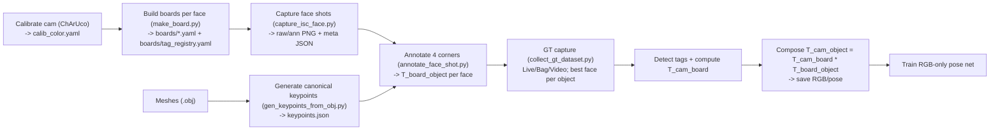

# GT-6DoF-ATag
Utilities and scripts to generate ground-truth 6-DoF object poses from RGB using AprilTags and Intel RealSense (D435i).
Designed for training RGB-only pose networks (e.g., ConPose) in pick-and-place / assembly scenarios.
## What this repo is for
A reproducible pipeline to convert AprilTags + a few clicks into high-quality 6-DoF ground truth for rigid objects, then capture multi-object scenes with readable poses for training/validation of RGB-only pose estimators.

## Contents

* **Calibration**: ChArUco colour camera calibration → `calib_color.yaml` (fx, fy, cx, cy, dist).
* **Board building**: Per-face AprilTag layout from a single frame → `<object_face>.yaml` and global `boards/tag_registry.yaml`.
* **Shot capture**: “Face shots” with overlays + meta → `boards/shots/*_{raw,ann,meta}`.
* **Mesh keypoints**: Canonical 3D keypoints per object → `objects/<object>/keypoints.json`.
* **Annotation**: Click 4 face corners on a shot to compute **T\_board\_object** for that face.
* **Batch annotation**: Drive the annotator across faces/shots automatically.
* **Ground truth capture**: Live/Bag/Video multi-object capture with per-frame review; best face per object; optional depth.
* **At runtime**: **T\_cam\_object = T\_cam\_board · T\_board\_object**.

---

## Quick start (scripts)

### 0) Generate AprilTags for printing

Contiguous IDs

```bash
python -m src.gen_april_tags --tag-size-mm 80 --id-start 46 --id-end 49 --pil-text
```

Non-contiguous IDs

```bash
python -m src.gen_april_tags --tag-size-mm 40 --ids 19,20,21,22,27,28,29,30
```

> Print at the correct physical size. The **black square** edge = `--tag-size-mm`.

---

### 1) Calibrate the colour camera (ChArUco)

SPACE to capture a sample; ENTER to solve:

```bash
python charuco_calibrate.py --squares-x 5 --squares-y 3 \
  --square-length-mm 50 --marker-length-mm 37 --dict 7X7_1000 \
  --width 640 --height 480 --min-samples 30 --out calib_color.yaml
```

Outputs `calib_color.yaml` with:

* `camera_matrix` (fx, fy, cx, cy)
* `distortion_coefficients` (k1, k2, p1, p2, k3)
* `image_width`, `image_height` (keep these consistent later)
* `reproj_rms` (px)

---

### 2) Build per-face boards and tag registry

For each *face*, capture one view with all its tags visible; pick an **origin** tag. The script estimates in-plane offsets/rotation and writes a board YAML and updates the registry.

```bash
python make_board.py \
  --object_name connection_plate_white_sideA \
  --calib calib_color.yaml \
  --tag_size_mm 80 \
  --out_dir boards \
  --save_shot \
  --z_thresh 0.01
# Repeat for sideB / other objects...
```

Outputs:

* `boards/<object_face>.yaml`  (origin\_id, tag\_size\_m, 2D offsets + yaw)
* `boards/tag_registry.yaml`   (tag ID → face YAML)
* Optional `boards/shots/*` audit images

> Faces may use different tag sizes; each face YAML stores its own `tag_size_m`.

---

### 3) Capture “face shots” for annotation

```bash
python -m src.capture_isc_face \
  --calib calib_color.yaml \
  --width 640 --height 480 --fps 30
```

Workflow:

* Enter object name (`connection_plate_white_sideA`, etc.)
* Select face index
* Live preview; **ENTER** to save

Outputs:

```
boards/shots/<object_face>_<face_key>_<YYYYMMDD_HHMMSS>_raw.png
boards/shots/<object_face>_<face_key>_<YYYYMMDD_HHMMSS>_ann.png
boards/shots/<object_face>_<face_key>_<YYYYMMDD_HHMMSS>_meta.json
```

---

### 4) Derive canonical 3D keypoints from meshes (once per object)

We write the 8 AABB corners in the **mesh frame** plus per-face corner ordering.

```bash
python -m src.gen_keypoints_from_obj \
  --obj meshes/connection_plate.obj \
  --object_name connection_plate_white \
  --units_to_m 1.0 \
  --auto_sides \
  --write_object_config
```

Outputs:

* `objects/<object_name>/keypoints.json`
* `objects/<object_name>/object_config.yaml`

---

### 5) Annotate each face shot → **T\_board\_object** (per face)

Click 4 corners; the tool detects tags to get **T\_cam\_board** and solves **T\_cam\_object**, then derives **T\_board\_object** for the face.

```bash
python -m src.annotate_face_shot --shot boards/shots/<object_face>_..._raw.png
```

Batch across faces (latest shot per face; skips existing):

```bash
python -m src.batch_annotate_faces
# Filters:
python -m src.batch_annotate_faces --object-filter connection_plate_white
python -m src.batch_annotate_faces --force
```

Outputs per face:

```
objects/<object_face>/faces/<face_key>_T_board_object.yaml
```

---

### 6) **Collect ground-truth dataset** (multi-object / multi-face)

Live RealSense, RealSense .bag, or any OpenCV-readable video. For each frame:

* Detect tags once (handles mixed tag sizes across faces).
* For each *object*, choose the **best visible face** (prefers more tags; tie-break by projected bbox area).
* Compose **T\_cam\_object = T\_cam\_board · T\_board\_object**.
* Live UI: left (annotated), middle (reprojection/tag debug), right (status/poses).

**Live (RGB, optional aligned depth)**

```bash
python -m src.collect_gt_dataset --mode live --session run01 \
  --calib calib_color.yaml --rs_w 640 --rs_h 480 --rs_fps 30
# Add --save_depth to save aligned depth .npy per accepted frame
```

**Playback (.bag)**

```bash
python -m src.collect_gt_dataset --mode bag --bag path/to/rec.bag \
  --session run02 --calib calib_color.yaml
```

**Any video**

```bash
python -m src.collect_gt_dataset --mode video --video sample.mp4 \
  --session run03 --calib calib_color.yaml
```

**Keys**

* `ENTER` / `y` / `s`  → **accept & save** current view
* `SPACE` / `p`        → pause/resume (you can accept while paused)
* `h`                  → toggle help
* `ESC` / `q`          → skip this instant
* `Q` / `X`            → quit all

> **Important:** The stream resolution must match `calib_color.yaml` (`image_width`/`image_height`).
> Use `--rs_w`/`--rs_h` or recalibrate.

**Outputs (per accepted frame)**

* `datasets/<session>/frames/<idx>_<ts>.png` — RGB frame
* `datasets/<session>/frames/<idx>_<ts>_reproj.png` — reprojection/diagnostic (optional)
* `datasets/<session>/frames/<idx>_<ts>_depth.npy` — aligned depth (if `--save_depth`)
* `datasets/<session>/frames/<idx>_<ts>.json` — metadata:

  ```json
  {
    "timestamp_sec": 1724631234.123,
    "camera": {
      "fx": 594.97, "fy": 601.72, "cx": 307.15, "cy": 267.01,
      "width": 640, "height": 480,
      "distortion_coefficients": [k1,k2,p1,p2,k3]
    },
    "tag_family": "tag36h11",
    "poses": {
      "<object_name>": {
        "object": "<object_name>",
        "face_key": "<object_face_key>",
        "board_yaml": "boards/<object_face>.yaml",
        "tag_used": 27,
        "num_tags_visible": 3,
        "score": 3150.0,               // ranking for best face (tags + area)
        "score_tags": 3,
        "score_area_px": 150000,
        "bbox_xywh": [x,y,w,h],        // pixels, top-left origin
        "T_cam_board": { "matrix": [[...],[...],[...],[0,0,0,1]] },
        "T_cam_object": { "matrix": [[...],[...],[...],[0,0,0,1]] },
        "translation_m": [tx, ty, tz], // meters, from T_cam_object
        "rpy_deg": [roll, pitch, yaw], // degrees (X=roll, Y=pitch, Z=yaw)
        "quat_xyzw": [qx, qy, qz, qw]  // quaternion (xyzw)
      }
      // ... one entry per object (best visible face only)
    }
  }
  ```
* `datasets/<session>/<session>` — newline-delimited capture log (one JSON per line) listing frame names, time, and saved objects.

---

## Ground-truth composition

At capture time:

1. Detect AprilTags in the RGB frame.
2. Pick a tag `i` on the face:

   * Tag solver → **T\_cam\_tagᵢ** using (fx, fy, cx, cy) and the face’s `tag_size_m`.
   * Board YAML → **T\_board\_tagᵢ** (board→tag).
   * **T\_cam\_board = T\_cam\_tagᵢ · (T\_board\_tagᵢ)⁻¹**.
3. From annotation: **T\_board\_object** for that face.
4. **Final pose**:

   $$
   T_{\text{cam}\to\text{object}} = T_{\text{cam}\to\text{board}} \cdot T_{\text{board}\to\text{object}}
   $$
5. We also report `translation_m`, `rpy_deg` (XYZ / roll-pitch-yaw), and `quat_xyzw`.

---

## Block diagram



---

## File layout

```
calib_color.yaml
boards/
  tag_registry.yaml
  <object_face>.yaml
  shots/
    <object_face>_<face>_<ts>_{raw,ann,meta}.{png,json}
objects/
  <object_name>/
    keypoints.json
    object_config.yaml
  <object_face>/
    faces/
      <face_key>_T_board_object.yaml
meshes/
  *.obj
datasets/
  <session>/
    <session>                 # JSON lines capture log
    frames/
      000000_*.png
      000000_*_reproj.png
      000000_*_depth.npy
      000000_*.json
src/
  gen_april_tags.py
  charuco_calibrate.py
  make_board.py
  capture_isc_face.py
  gen_keypoints_from_obj.py
  view_keypoints_on_obj.py
  annotate_face_shot.py
  batch_annotate_faces.py
  collect_gt_dataset.py
utils/...
```

---

## Notes & tips

* **Resolution must match calibration**: if `calib_color.yaml` is 640×480, start live with `--rs_w 640 --rs_h 480`.
* **Best face / best tag**: the capture tool chooses, per object, the face with more visible tags (tie-break by projected bbox area). The origin tag is preferred when visible; otherwise the tag with highest `decision_margin` is used.
* **Depth saving**: `--save_depth` writes aligned depth (`.npy`) per accepted frame (same pixel grid as RGB).
* **Pose fields**:

  * `translation_m` comes from `T_cam_object[:3,3]` (meters).
  * `rpy_deg` is roll-pitch-yaw in degrees (XYZ / OpenCV-style).
  * `quat_xyzw` is a unit quaternion in xyzw order.
* **Stability** (RealSense/Linux): we disable OpenCL, limit BLAS/OpenCV threads, warm up frames, and copy buffers to reduce driver hiccups.

